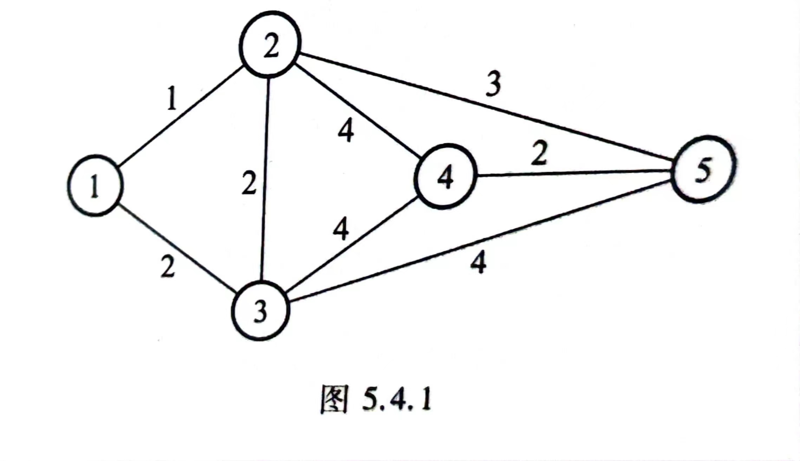
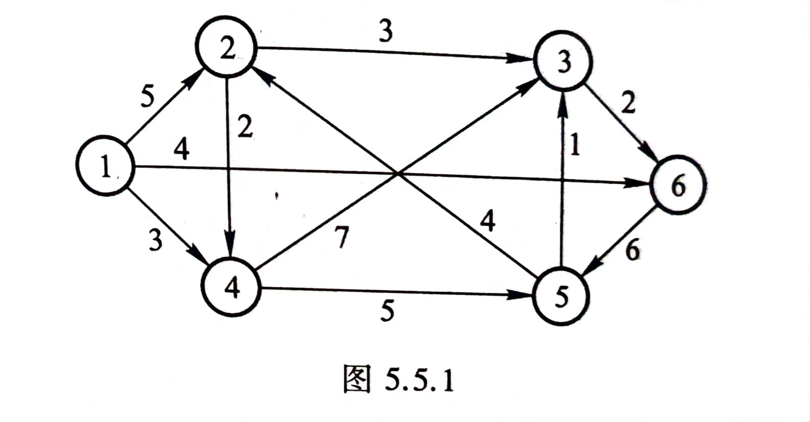

# 利用Python 复现运筹学算法

[TOC]

## 1. 前言

2023年9月我开始学习运筹学，课堂上老师让我们使用某种语言来实现运筹学算法，当时我选择使用C++，并艰难复现。最近希望整理一下这些C++，因为代码写得实在不好，又发现有些时间上的困难，所以我考虑转向利用Python来复现。

本文是代码的使用教程和例子分析，希望对大家有帮助。

在复现的过程中，我使用到的一些Python库有：NumPy，Matplotlib，gurobipy。所以再运行这些代码前，请确保已经安装了这些库。

本文的全部例子均来自于《运筹学》第四版，作者是刁在筠等。。希望本套算法能够为大家进一步理解运筹学算法的原理与实现，起到帮助。

同样的，读者可以尝试修改问题，修改输入参数，观察结果。

## Part 1 线性规划

关于线性规划的所有代码实现请看文件 [LP.py](./code/LP.py)
切换算法请修改注释符号```#```，同时确保符合代码使用条件

### 2. 单纯形法

单纯形法是1947年由 G.B.Dantzig 提出，是一种用于求解线性规划问题的算法。

本代码所考虑的是标准形式的LP问题，即：
$$
\min c^T x \\
\text{s.t.}  Ax = b \\
x \geq 0
$$

#### 2.1 代码解释

``` python
def simplex_solver(A, b, c):
```

调用本函数可以实现单纯形法的计算。几个注意事项如下

- 我采用了各个矩阵分开计算的方法，所以在初等行变换时，需要注意很可能乘以的系数已经改变，可以通过构建一个新变量，或者先处理c和b的行变换来完成
- python输入时需要注意，浮点数请使用0.，而不是0，否则默认为整数

#### 2.2 算例

- **第一章习题16 (2)**

$$
\min z = 3x_1 + x_2 + x_3 + x_4 \\
\text{s.t.}  -2x_1 + 2x_2 + x_3  = 4 \\
3x_1 + x_2  + x_4 = 6\\
x_i \geq 0 i=1,2,3,4
$$

- 编制主函数
  
``` python
def main():
    '''
    在此编辑问题形式
    min z = c^T x
    s.t. Ax = b
         x >= 0
    '''
    c = np.array([3., 1., 1., 1.])

    A = np.array([[-2., 2., 1., 0.],
                  [ 3., 1., 0., 1.]])
    
    b = np.array([4.,6.])
    
    '''调用单纯形法'''
    simplex_solver(A, b, c)

    '''调用对偶单纯形法'''
    # dual_simplex_solver(A, b, c)
```

- 输出

```code
iteration: 1
iteration: 2
目标函数值: 6.0
最优解: [0, 2.0, 0, 4.0]
```

### 3. 对偶单纯形法

对偶单纯形法是对偶理论在单纯形法的利用。我们从一个对偶可行解出发，逐步向原始可行解方向迭代。对于方便找到对偶可行基的问题，用对偶单纯形法十分方便。
对偶可行解的条件是：$\zeta \leq 0$
也就是检验数向量全负。

#### 3.1 代码解释

``` python
def dual_simplex_solver(A, b, c):
```

这次，我灵活运用了```python```中的```hstack()```函数，直接用矩阵的思维来处理，读者可以比较这之间的异同与方便之处

#### 3.2 算例

- **第一章 例1.5.5**

$$
\min z = x_1 + x_2 + x_3 \\
\text{s.t.}  3x_1 + x_2 + x_3 \geq 1 \\
-x_1 + 4x_2 + x_3 \geq 1 \\
x_1, x_2, x_3 \geq 0
$$

本问题不是标准形式的线性规划问题，所以先进行松弛，这里就不再松弛了，直接给出标准形式编制下的主函数：

``` python
def main():
    '''
    在此编辑问题形式
    min z = c^T x
    s.t. Ax = b
         x >= 0
    '''
    c = np.array([1., 1., 1., 0., 0.])

    A = np.array([[-3., -1., -1., 1., 0.],
                  [ 1., -4., -1., 0., 1.]])
    
    b = np.array([-1., -2.])
    
    '''调用单纯形法'''
    # simplex_solver(A, b, c)

    '''调用对偶单纯形法'''
    dual_simplex_solver(A, b, c)
```

- 输出

```code
iteration: 1
iteration: 2
iteration: 3
目标函数值: 0.6923076923076923
最优解: [0.15384615384615385, 0.5384615384615384, 0, 0, 0]
```

## Part 2 整数线性规划

要求变量取整数的线性规划称为整数线性规划
整数线性规划主要有两种算法：

- Gomory 割平面法
- 分支定界法

针对0-1规划，还有一种特殊的隐枚举法

本教程力在实现分支定界法

关于整数线性规划的所有代码实现请看文件 [ILP.py](./code/ILP.py)

### 4. 分支定界法

分支定界法的基本思想是利用分解技术，将整数规划问题分解为多个子问题的和，对每个字文通做到：

- 找到子域最优解
- 明确最优解不在子域

将可以简化问题，这个过程的重复进行，称为**分支**。

另外，为了降低计算量，还应该增加**剪枝**过程。
当出现某一分支的最优解大于目前最优分支时，该枝在之后增加约束的过程中只会增大，所以应当剪掉。

本代码仍然以线性规划问题的标准形式来建模。

#### 4.1 代码解释

``` python
def branch_and_bound_solver(A, b, c)
```

本函数实现了分支定界算法的框架，由于剪枝过程的存在，每次只需要在二叉树同一层次间比较即可，而且每次一定是父节点相同的两个子节点之间进行比较。

``` python
class Node:
    def __init__(self, A, b, c):

        # 节点对应问题
        self.A = A
        self.b = b
        self.c = c

        # 节点对应解
        self.obj_value = float('inf')
        self.x = None

    def solve(self)

    def check_not_integer(self):
```

本算法写了一个非常简单的节点类，来记录每个节点对应问题的形式，以及节点对应解。

本类还有一个```solve(self)```函数，用来调用求解器求解节点对应的问题。

```check_not_integer(self)```用来返回最优解中第一个非整数变量的索引，当全部为整数时返回-1

#### 4.2 算例

- **第二章 例2.3.1**

$$
\min z = -(x_1 + x_2)  \\
\text{s.t.}  -4x_1 + 2x_2 \leq -1 \\
4x_1 + 2x_2 \leq 11 \\
-2x_2 \leq -1 \\
x_1, x_2 \geq 0, 且为整数\\
$$

本问题求解需要考虑的问题比较多，因此使用```Gurobi```，来求解中间过程的松弛问题

- 主函数

``` python
def main():
    '''
    在此编辑问题形式
    min z = c^T x
    s.t. Ax = b
         x >= 0 且为整数
    '''

    c = np.array([-1., -1., 0., 0., 0.])

    A = np.array([[-4., 2., 1., 0., 0.],
                  [ 4., 2., 0., 1., 0.],
                  [ 0.,-2., 0., 0., 1.]])
    
    b = np.array([-1., 11., -1.])
    
    '''调用分支定界法'''
    root = branch_and_bound_solver(A, b, c)

    print("                         ")
    print("-------------------------")
    print("                         ")
    print("目标函数值:",root.obj_value)
    print("最优解:",root.x[:2])
    print("                         ")
    print("-------------------------")
    print("                         ")
```

- 输出

``` code
branch_and_bound_solver v_1.0
------------------
根节点
        当前最优值为: -4.0
        当前最优解为: [1.5, 2.5, 0.0, 0.0, 4.0]
------------------
分支树 第 1 层
    左子树:
        当前最优值为: -2.5
        当前最优解为: [1.0, 1.5, 0.0, 4.0, 2.0, 0.0]
    右子树:
        当前最优值为: -3.5
        当前最优解为: [2.0, 1.5, 4.0, 0.0, 2.0, 0.0]
------------------
分支树 第 2 层
    左子树:
        当前最优值为: -3.25
        当前最优解为: [2.25, 1.0, 6.0, 0.0, 1.0, 0.25, 0.0]
    右子树:
        无解
------------------
分支树 第 3 层
    左子树:
        当前最优值为: -3.0
        当前最优解为: [2.0, 1.0, 5.0, 1.0, 1.0, 0.0, 0.0, 0.0]
    右子树:
        无解

-------------------------

目标函数值: -3.0
最优解: [2.0, 1.0]

-------------------------
```

## Part 3 非线性规划

非线性规划研究的时非线性函数的数值最优化问题，我们求解非线性规划的一般方法是通过如下的**迭代下降框架**来实现。

$$
step 1: 选取初始点x^0,k:=0;\\
step 2: 构造搜索方向p^k;\\
step 3: 根据p^k,确定步长t_k;\\
step 4: 令x^{k+1} = x^k + t_kp^k;\\
若x^{k+1}满足某种终止条件，停止迭代，输出最优解x^{k+1}。\\
否则，k:=k+1,转step2
$$

确定第三步步长的问题就是一维搜索问题，所以先来实现一维搜索的相关算法

### 5. 一维搜索方法

一维搜索问题，英语为Line Search，是目标函数为单变量的非线性规划，其形式如下：

$$
\min_{t \geq 0} \phi(t)\\
$$

一维搜索有0.618法和Newton法两种方法。请参考代码[LineSearch.py](./code/LineSearch.py)

#### 5.1 0.618法（近似黄金分割法）

0.618法是单谷函数求极小点的一种方法

```python
def golden_section_search(a, b, fun, epsilon=1e-5)
```

默认精度为1e-5

#### 5.2 Newton法

```python
# 牛顿法主要过程
def newton_method(fun, x0, epsilon=1e-5)
# 求函数 fun 在 x 处的导数值
def derivation(fun, x, epsilon=1e-5)
# 求函数 fun 在 x 处的二阶导数值
def derivation_2(fun, x, epsilon=1e-5)
```

一维搜索方法非常简单，请看算例。

#### 5.3 算例

- 第三章 例3.3.1

$$
\min_{t \geq 0} \psi(t) = t^2 - 2t + 1\\
\psi(t) 单谷区间为[0,3]\\
\epsilon=0.5
$$

- 输出

```code
0.618法：
0.8164951516713731

牛顿法：
0.8164915810094755
```

### 6. 最速下降法

最速下降法是1847年由著名数学家柯西给出的，是解决无约束优化问题的古老解析方法，它也利用了迭代下降框架。本节的问题形式和第七节的形式相同，如下所示：

$$
\min_{x = (x_1...x_n)^T} f(x)  \\
$$

#### 6.1 代码解释

``` python
# 设置目标函数
def Objective(x)
# 最速下降法主算法
def steepest_descent(fun, x0, epsilon=1e-5)
# 求函数 fun 在 x 处的梯度
def gradient(fun, x, epsilon=1e-10)
# 求向量 x 的二范数
def norm2(x)
# 利用闭包生成动态函数
def set_dynamic_fun(x, p)
```

#### 6.2 算例

- 第三章 习题15 （1）

$$
\min f(x_1,x_2) = \frac{1}{3}x_1^2 + \frac{1}{2}x_2^2\\
x_0 = (2,2)^T\\ \epsilon=10^{-6}
$$

- 输出

``` code
第 1 次迭代
第 2 次迭代
第 3 次迭代
第 4 次迭代
第 5 次迭代
第 6 次迭代
第 7 次迭代
第 8 次迭代
x_opt = [7.67987275e-06 5.12005134e-06]
f(x_opt) = 3.276761133876685e-11
```

- 可视化

对于二维问题，我利用```Matplotlib```绘制了求解结果，可以展示迭代下降算法的拉锯现象，展示在图片[NLP_15_1](./pics/steepest_descent.png)中。如果你的应用是更高维的情况，请把可视化相关代码删掉。

### 7. 共轭方向法

共轭方向法是为求解凸二次函数问题设计的，它从任意点$x_0$出发，沿着某组共轭方向进行一维搜索方。该方法具有二次终止性。

#### 7.1 代码解释

```python
# 实现共轭方向法的主程序
def conjugate_direction_method(fun, x0, epsilon=1e-5)
# 补充的定界算法(位于 LineSearch.py )
def get_search_bound(fun)
```

这一节内，我补充了一个定界算法，来提高一维搜索的计算效率。

#### 7.2 算例

选择与最速下降法相同的算例，来比较两种算法的性能。

```code第 1 次迭代
第 1 次迭代
第 2 次迭代
共轭方向法：
x_opt = [ 1.21317563e-08 -3.76950233e-08]
f(x_opt) = 7.59517226343217e-16
```

很明显，共轭方向法的收敛速度更快，解的质量更高，迭代效果可以看图[conjugate_vs_steepest](./pics/conjugate_vs_steepest.png)

### 8. 简约梯度法

简约梯度法是Wolfe在1962年根据线性规划单纯形法的思想扩展而来的，所以本节问题的基本数学规划模型是：

$$
\min f(x)\\
\text{s.t.} Ax = b \\
x \geq 0
$$

#### 8.1 代码解释

```python
# 设置目标函数
def Objective(x)
# 简约梯度法主程序
def wolfe_method(fun, A, b, x0, epsilon=1e-5)
# 生成最大分量下标集
def gen_I_B(x,m)
# 跟据最大分量下标集分解矩阵 A
def decomposition(A, I_B)
# 跟据最大分量下标集分解梯度
def grad_decomposition(grad, I_B)
# 获得有效以为搜索上界
def get_upper_bound(p, x)
# 构造搜索方向 p
def construct_p(B_k, N_k, r_N, I_B, I_ext, x)
```

#### 8.2 算例

- 第三章 例3.5.2

$$
\min x_1^2 + x_2^2 + 2x_1x_2 + 2x_1 + 2x_2 \\
\text{s.t.} \text{      }x_1 + x_2 \leq 4\\
-x_1 + 2x_2 \leq 2\\
x_1,x_2 \geq 0
$$

本例显然需要松弛，不再赘述

- 主函数

```python
def main():
    '''
    完成一些问题的设置
    和最后解的显示
    '''

    # 设置初始值
    x0 = np.array([1., 1., 2., 2.])

    # 设置约束形式
    A = np.array([[ 1., 1., 1., 0.], 
                  [-1., 1., 0., 1.]])
    
    b = np.array([4., 2.])

    # 设置精度
    epsilon = 1e-6

    print("Wolfe_Solver v_1.0")

    # 调用 wolfe 法
    x_opt, x, y = wolfe_method(Objective, A, b, x0, epsilon)

    value = np.zeros(x.shape)

    for i in range(x.shape[0]):
        value[i] = Objective(np.array([x[i], y[i]]))

    print("x_opt=", x_opt[:b.shape[0]])
    print('f(x_opt) =', Objective(x_opt))

    # 可视化
    fig = plt.figure()
    ax = fig.add_subplot(111, projection='3d')
    
    ax.plot(x, y, value, 'r-', label='f(x)', color='blue', marker='x')
    
    plt.legend(loc = 'best')
    ax.set_xlabel('x_1')
    ax.set_ylabel('x_2')
    ax.set_zlabel('f(x)')

    plt.show()
```

- 输出

```code
Wolfe_Solver v_1.0
第 1 次迭代
第 2 次迭代
第 3 次迭代
第 4 次迭代
第 5 次迭代
第 6 次迭代
第 7 次迭代
第 8 次迭代
第 9 次迭代
第 10 次迭代
第 11 次迭代
第 12 次迭代
第 13 次迭代
第 14 次迭代
第 15 次迭代
第 16 次迭代
第 17 次迭代
第 18 次迭代
第 19 次迭代
第 20 次迭代
第 21 次迭代
第 22 次迭代
第 23 次迭代
第 24 次迭代
第 25 次迭代
第 26 次迭代
第 27 次迭代
第 28 次迭代
第 29 次迭代
第 31 次迭代
第 32 次迭代
第 33 次迭代
第 34 次迭代
第 35 次迭代
第 36 次迭代
x_opt= [1.96231335e-007 3.77863607e-196]
f(x_opt) = 3.9246270904541017e-07
```

## Part 4 图与网络分析

在图与网络分析部分，我们首先来实现两个最小树算法。

### 9 Kruskal算法 和 最小树的 Dijkstra算法

#### 9.1 Kruskal算法

Kruskal算法是1956年由Kruskal提出的，是解决无向图最小树问题的经典算法。其基本思想是尽量选择权值小的边，并且不构成回路。

#### 9.2 Dijkstra算法(最小树)

最小树的Dijkstra算法是1959年由Dijkstra提出的，其基本思路是从图G的n-1个独立边割中每一个都选一条权值最小的边。

##### 9.3 代码解释

代码见于[MST.py](./code/MST.py)

```python
class Graph:
    '''
    图类
    '''
    # 图的构造函数
    def __init__(self, n, m, edges, A)
    '''
    定义问题形式：
    1. 节点数: n
    2. 边数: m
    3. 边集合: edges
    4. 边的权值: weights
    5. 邻接矩阵: A
    '''
    # Kruskal算法的主程序
    def Kruskal(self):
    # Dijkstra算法的主程序
    def Dijkstra(self):  
    # 判断是否构成回路
    def not_ring(self, edge):
    # 修改标号
    def change_mark(self, edge, S):
    # 根据 R 和 S 集合生成标号       
    def gen_mark(self, R, S, mark):
```

#### 9.4 算例

- 第五章 图 5.4.1



- 主函数

```python
def main():
    '''
    定义问题形式：
    1. 节点数: n
    2. 边数: m
    3. 边集合: edges
    4. 边的权值: weights
    5. 邻接矩阵: A
    '''
    n = 5
    m = 8

    A = np.array([ [0, 1, 2, 0, 0],
                   [1, 0, 2, 4, 3],
                   [2, 2, 0, 4, 4],
                   [0, 4, 4, 0, 2],
                   [0, 3, 4, 2, 0]])

    edges = {(0,1):1,
             (0,2):2,
             (1,2):2,
             (1,3):4,
             (1,4):3,
             (2,3):4,
             (2,4):4,
             (3,4):2}
    
    MST = Graph(n, m, edges, A)
    S_1 = MST.Kruskal()
    print("Kruskal:")
    print(S_1)

    print("")
    S_2 = MST.Dijkstra()
    print("Dijkstra:")
    print(S_2)   
```

- 输出

```code
Kruskal:
[(0, 1), (0, 2), (3, 4), (1, 4)]

Dijkstra:
[(0, 1), (0, 2), (1, 4), (4, 3)]
```

### 10. Dijkstra算法——最短有向路题

Dijkstra算法适用于弧权为正值的有向网络中求最短路。

代码见于[shortest_directed_path.py](./code/shortest_directed_path.py)

#### 10.1 代码解释

```python
class Graph:
    '''
    图类
    '''

    def __init__(self, n, edges, start):
        '''
        初始化图
        :param n: 节点数
        :param edges: 边
        :param start: 起点
        '''
        self.n = n
        self.edges = edges
        self.start = start

    # 求最短有向路的 Dijkstra 算法的主程序
    def Dijkstra(self):
```

比较简单，没有用到其它函数，本图类与上一节图类基本一致，可以写在一个类，但是为了方便编写问题而分开。

#### 10.2 算例

- 第五章 图 5.5.1



- 主函数

```python
def main():
    '''
    定义问题形式：
    1. 节点数: n
    2. 边数: m
    3. 边集合: edges
    4. 边的权值: weights
    5. 邻接矩阵: A
    '''
    n = 6

    edges = {(0,1):5,
             (0,3):3,
             (0,5):4,
             (1,2):3,
             (1,3):2,
             (2,5):2,
             (2,4):4,
             (3,2):7,
             (3,4):5,
             (4,1):4,
             (4,2):1,
             (5,4):6}
    
    # 设置起点
    start = 1

    
    graph = Graph(n, edges, start)

    print("")
    distance, path = graph.Dijkstra()
    # 结果展示
    print("Dijkstra:")
    print("distance=",distance)

    for i in range(n):
        if distance[i] == float("inf"):
            print("no path from",start,"to",i)
        else:
            print("path from",start,"to",i,"is:")
            for j in path[i]:
                print(j,"-> ", end="")
            print(i)
```

- 输出

```code
第 1 轮循环
第 2 轮循环
第 3 轮循环
第 4 轮循环
第 5 轮循环
Dijkstra:
distance= [inf, 0, 3, 2, 7, 5]
no path from 1 to 0
path from 1 to 1 is:
1 -> 1
path from 1 to 2 is:
1 -> 2
path from 1 to 3 is:
1 -> 3
path from 1 to 4 is:
1 -> 3 -> 4
path from 1 to 5 is:
1 -> 2 -> 5
```
